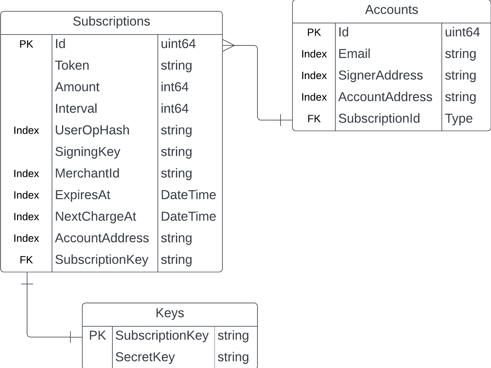

# silver-arrow

Backend service for powering subscriptions on Lucid.

**IMPORTANT!!!**

This service relies heavily on ERC-4337 primitives and zerodev [kenel](https://github.com/zerodevapp/kernel). Kernel is a modular smart contract wallet implementation that is built on the ERC-4337 standard.

ERC-4337 is an account abstraction proposal which completely avoids the need for consensus-layer protocol changes. Instead of adding new protocol features and changing the bottom-layer transaction type, this proposal introduces a higher-layer pseudo-transaction object called a UserOperation. Users send UserOperation objects into a new separate mempool. Bundlers package up a set of these objects into a single transaction by making a call to a special contract, and that transaction then gets included in a block.

By leveraging this pseudo-transaction object, user intents can be originated offchain and validated by the wallet itself onchain. This allows us to be able to implement pull payments in the smart contract wallet, inherently enabling subscriptions.

## Run locally

- Pull the latest changes from git
- run ```go get```
- set the environment variables
- run ```APP_ENV=development go run cmd/server.go```

## Data relationship
 

## Modules/Packages

### erc-4337

Contains logic to handle erc-4337 related things like communicating with the bundler, paymaster for gas abstraction, smart contract interactions and parsing user intents

### wallet

Core wallet logic, subscription handling.

### scheduler

contains logic to handle scheduling a subscription

### tests

contains integration tests

### abi

Contains abis and bindings for the smart contracts silver-arrow interacts with.

```shell
abigen --abi LucidTokenActions.abi --bin LucidTokenActions.bin --pkg lucidTokenActions --type LucidTokenActions --out ../lucidTokenActions/LucidTokenActions.go
```


### graph

Graphql related code

### repository

The data handling layer and model lives here



```sql
Subscriptions
CREATE TABLE "Subscriptions" (
  "Id" uint64,
  "Token" string,
  "Amount" int64,
  "Interval" int64,
  "UserOpHash" string,
  "Interval" int64,
  "Active" bool,
  "MerchantId" string,
  "ExpiresAt" DateTime,
  "NextChargeAt" DateTime,
  "AccountAddress" string,
  "SubscriptionKey" string,
  "AccountID" uint64,
  PRIMARY KEY ("Id")
);

CREATE INDEX "Index" ON  "Subscriptions" ("UserOpHash", "Active", "MerchantId", "ExpiresAt", "NextChargeAt", "AccountAddress");

CREATE INDEX "Key" ON  "Subscriptions" ("Interval");

/* Accounts */
CREATE TABLE "Accounts" (
  "Id" uint64,
  "Email" string,
  "SignerAddress" string,
  "AccountAddress" string,
  "SubscriptionId" Type,
  PRIMARY KEY ("Id")
);

CREATE INDEX "Index" ON  "Accounts" ("Email", "SignerAddress", "AccountAddress");

Keys
CREATE TABLE "Keys" (
  "SubscriptionKey" string,
  "SecretKey" string,
  PRIMARY KEY ("SubscriptionKey")
);

0xF0309DDDe30c75A6211565774E48c3733bf87F84
Mumbai
```

## AUTHORIZATION

```
Authorization: "Bearer `public_key`
X-Lucid-Request-Signature: `<signed-request>`
Lucid-Request-Hash: `<sha256-hashed-request>`

```